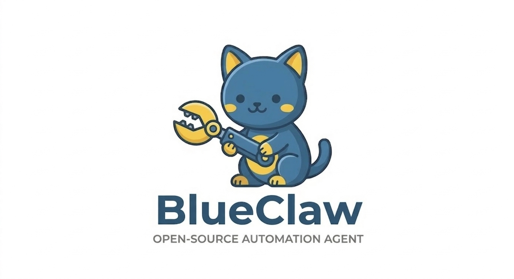

<p align="center">
  
</p>

<p align="center">
  <strong>Persistent, interactive terminal automation agent</strong><br>
  Built on <a href="https://github.com/strands-agents/sdk-python">Strands Agents SDK</a>
</p>

<p align="center">
  <a href="#quickstart">Quickstart</a> •
  <a href="#features">Features</a> •
  <a href="#model-support">Models</a> •
  <a href="#configuration">Configuration</a> •
  <a href="#architecture">Architecture</a>
</p>

---

## What is BlueClaw?

BlueClaw is a Python-native terminal automation agent that remembers context across sessions. Give it a goal, and it researches, fetches, processes, and writes — all within a sandboxed workspace.

```
blueclaw> research the MCP ecosystem, focus on Python SDKs
● web_search({"query": "MCP Model Context Protocol Python SDK"})
  ✓ 1.2s
● http_request({"url": "https://modelcontextprotocol.io/..."})
  ✓ 0.8s
Done · 2 steps · 1840 tokens · $0.0073 · 4.1s
```

## Quickstart

```bash
# Install
pip install -e .

# Initialize workspace
blueclaw init

# Set your API key
echo "ANTHROPIC_API_KEY=sk-ant-..." > .env

# Start an interactive session
blueclaw

# Or run a single prompt
blueclaw run "summarize the latest Python 3.13 release notes"
```

## Features

- **Interactive + scripted modes** — `blueclaw` for chat, `blueclaw run "..."` for one-shot
- **Persistent memory** — `CONTEXT.md` carries facts across sessions, `history.jsonl` logs every run
- **Model-agnostic** — swap between Claude, Ollama, OpenAI, Gemini with one flag
- **Workspace sandbox** — path validation + destructive command deny-list
- **Execution tracing** — structured JSON traces with per-step timing, input/output summaries, and CLI viewer
- **Output truncation** — 12k char limit prevents context blowout
- **Domain allowlist** — conversational approval for web requests
- **Crash recovery** — per-turn checkpoints in `.blueclaw/last_turn.md`
- **MCP support** — bundled `pdf-mcp` server, custom stdio/SSE servers via config
- **Skill system** — progressive loading, index in prompt, full content on demand

## Model Support

```bash
# Anthropic (default)
blueclaw

# Ollama (local, no data leaves your machine)
blueclaw --model ollama/llama3

# OpenAI
blueclaw --model openai/gpt-4.1-mini

# Gemini via LiteLLM
blueclaw --model litellm/gemini/gemini-2.0-flash
```

Set API keys in `.env`:

```
ANTHROPIC_API_KEY=sk-ant-...
OPENAI_API_KEY=sk-...
```

## Commands

| Command | Description |
|---|---|
| `blueclaw` | Start interactive session |
| `blueclaw run "..."` | Execute a single prompt and exit |
| `blueclaw init` | Initialize workspace directory |
| `blueclaw history` | View past run history |
| `blueclaw trace list` | List recent execution traces |
| `blueclaw trace show <run_id>` | Show detailed trace for a run |
| `blueclaw --version` | Print version |
| `blueclaw --model provider/model` | Override model for this session |

## Configuration

`blueclaw.yaml` in your project root:

```yaml
model:
  provider: anthropic
  model_id: claude-sonnet-4-6

workspace:
  path: ~/blueclaw/workspace/

tools:
  - web
  - github
  - pdf
  - mcp:https://localhost:8080/sse  # custom MCP server

allowlist_domains:
  - github.com
  - docs.python.org
```

## Architecture

```
Terminal input → cli.py → session.py → Strands Agent → Tools → workspace.py (sandbox) → observer.py (trace) → Response
```

| Module | Purpose | Lines |
|---|---|---|
| `cli.py` | Typer entrypoints, welcome banner, trace viewer | ~375 |
| `session.py` | Config, model factory, agent, chat loop | ~420 |
| `workspace.py` | Sandbox enforcement, context/history/trace I/O | ~180 |
| `observer.py` | Structured tool tracing + output truncation | ~150 |
| `models.py` | Pydantic models, trace schema, cost calculation | ~100 |
| `tools/` | Web tools (factory pattern) + MCP wiring | ~100 |
| `approval.py` | Domain allowlist hooks | ~50 |

## Workspace Structure

```
~/blueclaw/workspace/
├── CONTEXT.md                    # Persistent agent knowledge (human-editable)
└── .blueclaw/
    ├── history.jsonl             # Append-only run log
    ├── last_turn.md              # Crash recovery checkpoint
    └── traces/                   # Structured execution traces
        └── 20260315-101201.json  # One JSON file per run
```

## Development

```bash
# Install in dev mode
pip install -e ".[dev]"

# Run tests
pytest

# Lint
flake8 blueclaw/ tests/
black --check blueclaw/ tests/
```

## License

MIT
